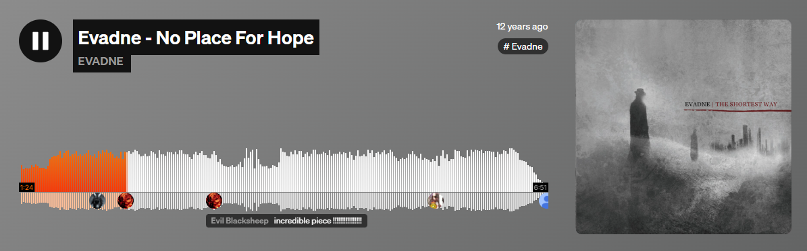

# PEC3 — Manovich Reloaded
## Análisis de hibridación contemporánea: Suno AI y SoundCloud

Repositorio correspondiente a la PEC3 de Cultura Digital (UOC): análisis de dos casos contemporáneos de hibridación siguiendo las aportaciones de Lev Manovich.

- Autor: Alejandro García Membiela
- Fecha: Mayo 2026

**Licencia:** Este trabajo se publica bajo Creative Commons CC BY-SA 4.0.

## Introducción

La hibridación, según Manovich, aparece cuando las técnicas, lógicas y estructuras de distintos medios se fusionan para dar lugar a una nueva gestalt mediática. No se trata de superponer capas —como ocurre en la multimedia— ni de transformar un medio en otro —como en la remediación—, sino de crear un sistema donde las propiedades de medios previamente separados se integran en un único entorno informático. En palabras de Manovich, es el momento en que «las interfaces y técnicas exclusivas de distintos medios se convierten en elementos de software que pueden combinarse por vías antes imposibles» (Manovich, 2013).

Con estas «gafas de Manovich», este ensayo analiza dos casos contemporáneos que no aparecen en sus libros, pero que encajan plenamente en su concepto de hibridación: **Suno AI**, como ejemplo de hibridación algorítmica en la producción musical, y **SoundCloud**, como caso de hibridación sociosonora en la circulación, participación y recomendación de contenido. Ambos casos permiten observar cómo el software reconfigura prácticas culturales tradicionales —componer, escuchar, compartir— y cómo los principios de los nuevos medios (representación numérica, modularidad, automatización, variabilidad y transcodificación cultural) se manifiestan en sistemas actuales (Manovich, 2013; Adell, 2024).

A partir de estos dos ejemplos, el documento explora cómo la hibridación se ha convertido en una característica estructural de la cultura digital contemporánea y cómo estos medios podrían formar parte de una hipotética nueva edición de *El software toma el mando*.

A continuación se desarrollan los dos casos seleccionados, aplicando los principios de los nuevos medios y el concepto de hibridación propuesto por Manovich.

## Metodología del análisis

El análisis de los dos casos se realiza aplicando los principios de los nuevos medios formulados por Manovich (2013): representación numérica, modularidad, automatización, variabilidad y transcodificación cultural. En cada caso se describen primero las características del medio y, a continuación, se interpretan desde estas categorías teóricas. Las evidencias empíricas (capturas, audio y documentación del proceso) se presentan de forma separada para mantener la claridad expositiva y distinguir entre el discurso conceptual y el material de apoyo, tal como se indica en el enunciado de la PEC3.

# Caso 1 – Suno AI: Hibridación algorítmica y metacreación

Para analizar Suno AI sin caer en reduccionismos técnicos, es necesario partir de una definición explícita de hibridación. Como señala Adell (2024), la hibridación no consiste en yuxtaponer capas multimedia, sino en la fusión profunda de técnicas y propiedades de distintos medios para generar una gramática nueva. Con estas «gafas de Manovich», Suno no puede entenderse como una simple herramienta de IA: es un medio híbrido donde el lenguaje natural, la síntesis sonora y la composición musical convergen en un entorno algorítmico que reconfigura la práctica creativa.

## 1. Representación numérica y transcodificación del lenguaje

En Suno, el texto no es un metadato ni un descriptor: es el origen estructural del sonido. El prompt del usuario —capa cultural— se transcodifica en vectores numéricos que dictan la morfología de la onda sonora —capa informática—. Esta traducción directa ejemplifica el principio de representación numérica (Manovich, 2013) y, al mismo tiempo, la transcodificación cultural: el saber hacer musical se desplaza desde la técnica instrumental hacia la capacidad de formular instrucciones precisas al algoritmo. No cambia solo el soporte, sino el comportamiento del creador.

## 2. Modularidad: del DAW al modelo generativo

Aunque Suno no utiliza pistas, clips o instrumentos como un DAW tradicional, su funcionamiento es profundamente modular. El sistema opera mediante bloques funcionales independientes:

- Módulo de interpretación del prompt.
- Módulo de generación melódica.
- Módulo de síntesis vocal.
- Módulo de mezcla y masterización automática.

Cada módulo actúa como una unidad autónoma dentro del *pipeline* generativo (Manovich, 2013). Esta modularidad permite reorganizar la producción musical sin intervención humana, algo imposible en un estudio analógico. La estructura del medio ya no depende de objetos físicos (pistas, instrumentos), sino de funciones algorítmicas encadenadas.

## 3. Automatización y variabilidad: escribir sin escribir

El principio de automatización es evidente: Suno asume tareas que antes requerían músicos, productores y técnicos. Pero lo decisivo es la variabilidad. Cada prompt genera múltiples versiones posibles, y cada regeneración altera parámetros melódicos, tímbricos o rítmicos. No existe una «obra definitiva», sino un espacio de posibilidades donde el usuario selecciona, itera y refina. La creación se convierte en un proceso de curaduría algorítmica: el usuario no compone en sentido clásico, sino que navega entre variantes generadas por el sistema (Manovich, 2013).

## 4. Remezclabilidad profunda: la pérdida de fronteras

Suno encarna la «Remezclabilidad profunda» descrita por Manovich (2013):

- Una interfaz textual —propia del procesamiento de palabras— se convierte en un estudio de grabación virtual.
- Estilos incompatibles en el mundo físico (jazz + metal, ópera + trap) se combinan mediante cálculo matemático.
- La síntesis vocal remedia la voz humana, pero añade propiedades imposibles (afinación perfecta, timbres híbridos, articulación no humana).

Aquí la hibridación no es estética, sino estructural: los medios se mezclan a nivel de técnicas, no de superficies. El resultado no es una mezcla de géneros, sino un medio nuevo donde el texto, el sonido y el algoritmo forman una unidad inseparable (Manovich, 2013).

## 5. La mutación del autor

La transcodificación afecta al propio rol del creador. El músico deja de ser ejecutante para convertirse en diseñador de instrucciones. La autoría se hibrida: parte humana, parte algorítmica. El software no solo «toma el mando», sino que redefine qué significa crear música (Manovich, 2013) en la cultura digital contemporánea. Por todo ello, Suno AI constituye un caso paradigmático de hibridación moderna, puesto que ejemplifica cómo la integración de texto, sonido y cálculo reconfigura la práctica creativa y plantea la necesidad de revisar los marcos teóricos de Manovich.

Esta mutación del rol autoral no es solo técnica, sino también cultural: desplaza el prestigio desde la destreza instrumental hacia la capacidad de diseñar prompts eficaces y de interpretar críticamente los resultados. Desde la perspectiva de Manovich (2013), Suno ejemplifica cómo la lógica informática impregna la capa cultural: el músico adopta prácticas propias del diseño de software (iterar, depurar, versionar) aplicadas a la creación sonora. En este sentido, Suno no solo genera canciones, sino que introduce una nueva alfabetización mediática basada en la escritura algorítmica de la música.

  
   
  <em style="0.5em">Figura 1: Interfaz de generación en Suno AI. Se observa la transcodificación de instrucciones textuales en una estructura sonora compleja.</em>

---

# Caso 2 – SoundCloud: Hibridación sociosonora y redes de datos

Si Suno AI representa la hibridación en la producción musical, SoundCloud ejemplifica la hibridación en la circulación, la escucha y la participación colectiva (Manovich, 2013). Para analizarlo sin caer en simplificaciones, conviene partir de una definición explícita de hibridación. Como señala Adell (2024), la hibridación no consiste en superponer capas multimedia, sino en fusionar técnicas y propiedades de distintos medios para generar una gramática nueva. Con estas «gafas de Manovich», SoundCloud no es un repositorio de audio: es un metamedio donde el sonido, la interacción social y los datos se integran en un único entorno informático.

## 1. Representación numérica: la forma de onda como interfaz social

La forma de onda de SoundCloud no es una mera visualización técnica heredada del osciloscopio. Es una interfaz híbrida donde el audio —flujo temporal— se combina con el texto —comentarios anclados en puntos concretos—. Esta operación encarna el principio de representación numérica: el sonido se convierte en datos manipulables, y esos datos se abren a la intervención social. La escucha deja de ser un acto privado para convertirse en una experiencia colectiva mediada por la capa informática (Manovich, 2013).

  
   
  <small><em>Figura 2: La forma de onda como interfaz social. Los comentarios anclados demuestran la hibridación entre el flujo temporal del audio y la capa de datos social.</em></small>

## 2. Modularidad: audio, metadatos y comunidad como bloques recombinables

SoundCloud organiza su ecosistema mediante módulos independientes:

- El archivo de audio.
- Los metadatos generados por el usuario (etiquetas, reposts, descripciones).
- La red social (seguidores, comentarios).
- El algoritmo de recomendación.

Esta modularidad permite que cada pieza funcione como un objeto autónomo dentro del sistema, pero también como parte de una estructura mayor. Un track no es solo un archivo: es un nodo que se reconfigura según su contexto social y algorítmico (Manovich, 2013).

## 3. Automatización y variabilidad: la escucha como flujo dinámico

El principio de automatización aparece en las recomendaciones, los feeds personalizados y la organización algorítmica del catálogo. La plataforma decide qué aparece, cuándo y para quién. A su vez, la variabilidad se manifiesta en que cada usuario experimenta SoundCloud de forma distinta: listas dinámicas, sugerencias basadas en comportamiento, versiones remezcladas, reposts que alteran la circulación del contenido. No existe un «SoundCloud universal», sino múltiples SoundClouds generados en tiempo real (Manovich, 2013).

## 4. Transcodificación cultural: del mixtape al ecosistema colaborativo

Siguiendo a Gea (2022), SoundCloud opera bajo una lógica de inteligencia colectiva. La plataforma no solo almacena sonido: almacena comportamientos. La transcodificación cultural se hace evidente cuando prácticas analógicas —la maqueta, el mixtape, el intercambio de demos— se transforman en dinámicas digitales: compartir, comentar, remezclar, versionar. Inspirado en la lógica de los repositorios de software descrita por McMillan (2012), SoundCloud puede entenderse como una especie de «GitHub de la música»: los audios pueden ser *forkeados* simbólicamente mediante reposts, remixes o comentarios que alteran su significado social.

## 5. Conclusión: un caso paradigmático para una nueva edición de Manovich

SoundCloud demuestra que la hibridación no es un fenómeno estético, sino estructural. El audio, la red social y la analítica algorítmica se fusionan en un medio nuevo donde la escucha, la publicación y la interacción forman un mismo proceso. Por su capacidad para integrar capas culturales y capas informáticas, SoundCloud ejemplifica una hibridación sociosonora que obliga a repensar la circulación y la autoría en la era del software. 

Además, SoundCloud reconfigura la figura del oyente, que pasa de ser receptor pasivo a participante activo en un ecosistema sociosonoro. La posibilidad de comentar, repostear o incrustar pistas en otros contextos convierte cada escucha en una acción potencialmente pública y trazable. Desde las gafas de Manovich (2013), esta trazabilidad forma parte de la transcodificación cultural: la experiencia musical se redefine en términos de métricas, visibilidad y circulación en red, lo que afecta tanto a la producción como a la recepción de la música.

---

## Conclusión general

Los dos casos analizados —Suno AI y SoundCloud— muestran que la hibridación es una transformación estructural que afecta a la producción, circulación y experiencia de los medios, y no un fenómeno superficial ni estético. Suno ejemplifica la hibridación algorítmica en la creación musical, donde el texto, el sonido y el cálculo se integran en un único proceso; SoundCloud, por su parte, evidencia la hibridación sociosonora, donde el audio, la interacción social y los datos se fusionan en un mismo entorno informático.

Ambos casos confirman la tesis de Manovich: el software no solo remedia los medios anteriores, sino que los reconfigura desde dentro, generando nuevas gestalts mediáticas. En conjunto, **Suno** y **SoundCloud** representan formas contemporáneas de hibridación que exceden los ejemplos originales de Manovich; por su carácter paradigmático, ambos serían candidatos naturales para ser incluidos en una nueva edición de *El software toma el mando*.

Desde una perspectiva personal, trabajar estos dos casos con las gafas de Manovich ha cambiado mi forma de mirar herramientas que uso casi a diario. Suno y SoundCloud dejan de ser «apps útiles» para convertirse en laboratorios donde se ve cómo el software reorganiza prácticas culturales muy arraigadas. Esta toma de conciencia es, en sí misma, un efecto de la hibridación: una vez que percibes las dos capas —cultural e informática— ya no puedes volver a ver estos medios como algo neutro o transparente.

---

Las evidencias se presentan de forma separada del análisis para mantener la claridad expositiva y seguir la recomendación metodológica de distinguir entre el discurso conceptual y el material empírico, tal como se indica en el enunciado de la PEC3.

## Evidencias complementarias

A continuación se incluyen las evidencias prácticas asociadas a los dos casos analizados.
Todo el material se encuentra en la carpeta `/evidencias/` del repositorio.

### Evidencias del Caso 1 — Suno AI

El análisis completo del experimento de hibridación musical con IA, incluyendo diseño del prompt, iteraciones, letra final, capturas y archivo de audio, puede consultarse en:

**[estudio_hibridacion_musical_IA.md](./evidencias/estudio_hibridacion_musical_IA.md)**

Archivos asociados:

- **Proceso de creación (antes):** [suno_captura_antes.png](./evidencias/suno_captura_antes.png)  
  Captura del estado inicial del pipeline generativo antes de aplicar la hibridación extrema del prompt.

- **Proceso de creación (durante):** [suno_captura_durante.png](./evidencias/suno_captura_durante.png)  
  Muestra la fase intermedia donde el modelo ajusta melodía, timbre y estructura según el prompt híbrido.

- **Proceso de creación (después):** [suno_captura_despues.png](./evidencias/suno_captura_despues.png)  
  Resultado final del proceso generativo antes de la exportación del audio.

- **Resultado final (MP3):** [jan_-_ascension_barroca_hibrida.mp3](./evidencias/jan_-_ascension_barroca_hibrida.mp3)  
  Archivo de audio generado tras la hibridación algorítmica de estilos.

### Evidencias del Caso 2 — SoundCloud

Capturas que muestran la hibridación sociosonora, la modularidad del medio y la intervención algorítmica en la navegación:

- **Forma de onda con comentarios**: [soundcloud_waveform.png](./evidencias/soundcloud_waveform.png)  
  Ejemplo de interfaz híbrida donde el audio se combina con comentarios anclados en puntos temporales.

- **Metadatos, participación social y fans**: [soundcloud_metadatos.png](./evidencias/soundcloud_metadatos.png)  
  Captura que muestra la modularidad entre audio, metadatos y red social.

- **Recomendaciones algorítmicas (RELATED TRACKS)**: [soundcloud_recomendaciones.png](./evidencias/soundcloud_recomendaciones.png)  
  Evidencia del papel de la automatización y variabilidad en la experiencia de escucha.

---

## Referencias

- Adell, J. (2024). *Hibridación y nuevos medios*.  
- Gea, M. (2022). *Herramientas y metodología crowdsourcing para la participación y creación colectiva de conocimiento abierto*.  
- McMillan, R. (2012). *Lord of the Files: How GitHub Tamed Free Software*.  
- Manovich, L. (2013). *El software toma el mando*. Editorial UOC.

---

## Declaración de uso de IA

Este trabajo ha utilizado herramientas de IA generativa únicamente como apoyo en tareas de redacción, revisión estilística y estructuración del texto. Las ideas, la selección de casos, el análisis teórico y las decisiones finales sobre el contenido corresponden exclusivamente al autor. El uso de IA se ha realizado siguiendo las directrices de la UOC para el uso responsable de estas herramientas.
